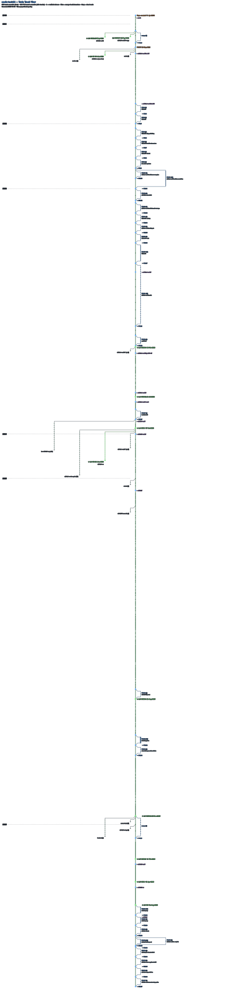

# UBL repository history

This branch holds an analysis of the history of the official UBL repository,
[oasis-tcs/ubl](https://github.com/oasis-tcs/ubl): which commit each published
UBL release was built from, how the branches relate to each other, and facts
about branches that GitHub recorded but git does not keep.

It is not part of UBL. It is an orphan branch: it shares no history with the
UBL branches and must never be merged into them. It has no build workflow, so
pushing to it starts no build.

## What is here

| File | What it is | How it is made |
|---|---|---|
| `release-commit-mapping.md` | Each published UBL release from 2.3 CSD05 to 2.5 OS, and the ISO/IEC branch of 2.5, with the commit it was built from and the evidence for it | By hand (method described in the file) |
| `branch-forensics.json` | Branch renames, deleted branches, bookmark branches, branches created since the first analysis, and which branch name was in use when, from the GitHub Activity API and the workflow runs | By hand, from the GitHub API |
| `api-data/2026-10-08/` | The raw GitHub API data of 8 October 2026 behind the latest additions: activity, workflow runs, artifacts, the two UBL 2.5 OS build logs, and hash lists of the OS build artifacts and of the published CS01 and OS packages. Its `REPORT.md` says how it was gathered; `SHA256SUMS.txt` checks the files | Gathered read-only from the GitHub API; not to be edited |
| `branch-tree.json` | The data both scripts read: the branch tree with the recorded head of every branch, the trunk branch, the CSV column order, and the diagram's side branches, releases and milestones | By hand |
| `chronological-timeline.csv` | Every commit of every branch, one row each, in date order, with the branch it belongs to | `generate-timeline.py` |
| `timeline-rules.md` | The rules the timeline follows | By hand |
| `trunk-train.svg` | A "train track" diagram: the main line of commits, the branches that left and rejoined it, and the releases | `gen_train4.py` |
| `trunk-train.png` | The same diagram as a picture | Rendered from the SVG (see below) |
| `generate-timeline.py`, `gen_train4.py` | The two scripts | |

Every commit hash in these files is a commit in oasis-tcs/ubl. To look one up,
open `https://github.com/oasis-tcs/ubl/commit/<hash>` or use any clone of that
repository. The hashes stay valid as long as the history of oasis-tcs/ubl is
not rewritten; merging, opening pull requests and deleting merged branches
never do that.

## What it covers

The analysis was made between 31 March and 3 April 2026 and brought up to date
on 8 October 2026. It covers the history up to commit `29ae6b4` on `ubl-2.6`
(8 October 2026, 12:10 UTC):

- the releases up to UBL 2.5 OS (12 August 2026), built from `345386a`, and
  the branch for the ISO/IEC version of UBL 2.5 (`ubl-2.5-iso`, `8630a5f`);
- the branches `ubl-2.5-cs01`, `ubl-2.5-os`, `ubl-2.5-iso` and `ubl-2.6`;
- the main line ("trunk") as the first-parent chain of `ubl-2.6` (373
  commits), which continues the old `ubl-2.5` trunk unchanged;
- the deletion of `ubl-2.5-python` (8 October 2026; its last commit `6c4d314`
  is also in `ubl-2.5` and `ubl-2.6`).

Not yet covered: anything in oasis-tcs/ubl after `29ae6b4`, including the
UBL 2.6 stages. `CLAUDE.md` lists what an update involves.

## Making the timeline and the diagram again

The scripts need Python 3 and git, nothing else, and no network access. They
read the history from a clone of oasis-tcs/ubl.

1. Make a full clone (not a shallow one):

   ```sh
   git clone https://github.com/oasis-tcs/ubl.git ubl-official
   ```

2. In the folder where the results should go (for example a checkout of this
   branch), run:

   ```sh
   python3 generate-timeline.py /path/to/ubl-official
   python3 gen_train4.py /path/to/ubl-official
   ```

   They write `chronological-timeline.csv` and `trunk-train.svg` to the current
   folder, and read `branch-tree.json` and `branch-forensics.json` from the
   folder the scripts are in.

The scripts read every branch from the head commit recorded for it in
`branch-tree.json`, not from `origin/<branch>`. So they make the same files
after branches have moved on or been deleted, as long as the clone contains
those commits. A fresh clone contains a deleted branch's commits only if
another branch still contains them, as `ubl-2.5` and `ubl-2.6` do for
`ubl-2.5-python`; if a branch is deleted whose commits are on no other branch,
record that in `branch-forensics.json` and keep a clone made before the
deletion. The timeline script reports on stderr each
branch that has moved since or no longer exists. If a recorded head is not in
the clone, it stops and names the branch.

On 8 October 2026 the scripts reproduced, from a plain clone, the committed
`chronological-timeline.csv` and `trunk-train.svg` byte for byte. The date in
the diagram is the `as_of` date in `branch-tree.json`, not the day the script
runs.

`trunk-train.png` has no script. It was rendered from the SVG at 1:1 with
headless Chromium, which keeps the SVG's dark background:

```sh
printf '<!doctype html><style>html,body{margin:0;background:#0d1117}img{display:block}</style>' > page.html
chromium --headless=new --hide-scrollbars --force-device-scale-factor=1 \
  --window-size=1364,<SVG height + 300> --screenshot=full.png page.html
convert full.png -crop 1364x<SVG height>+0+0 +repage -strip trunk-train.png
```

The window is made taller than the SVG and the picture cropped afterwards,
because Chromium's visible area is a little smaller than the window.
